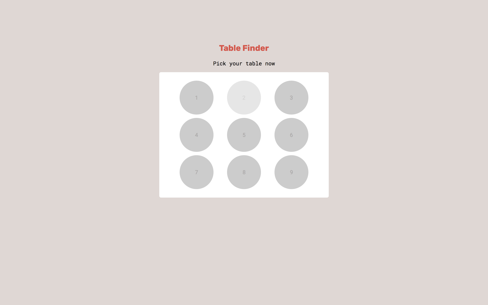
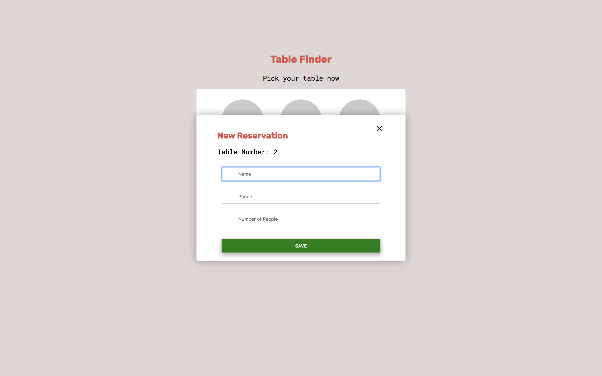
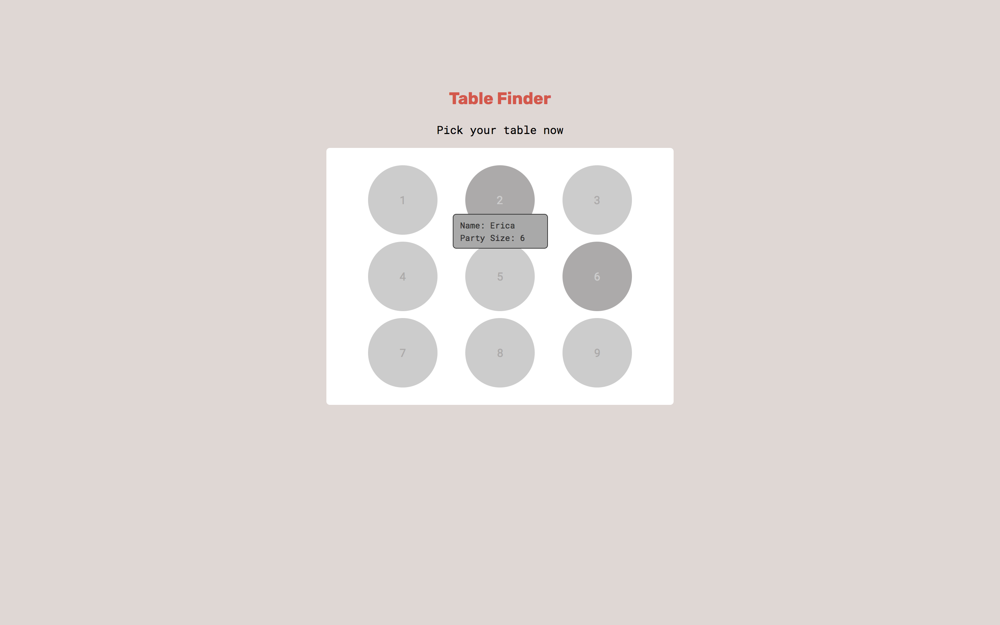

# restaurant-table-reserver
 The application will display the layout of the restaurant and servers will be able to identify which tables are reserved or available easily. Once the server sits a party, they can mark the table as taken.

Task: Set up the initial website using HTML/CSS/jQuery based on the wireframes given to you.
What does the application do?

1. Displays the restaurant’s floor plan.
2. Visually notifies the user that seats are available or not.
3. Displays a form when an open table is clicked on.
4. Hides the form when the user submits the form.

Build Specifications:
1. Each table must have either an “available” or a “reserved” class.
2. The form must remain hidden until a user clicks on a table with the class “available”.
3. There should be a way for the user to exit the form without submitting.
4. When the user submits the form, the form is hidden, and the class of the selected seat
is changed from “available” to “reserved”.
5. Change the cursor property to “not-allowed” if the table has a “reserved” class.
6. Changes the appearance of an open table when the mouse moves over the table, as
well as changes the cursor.

Format: 

Format: 

Format: 
